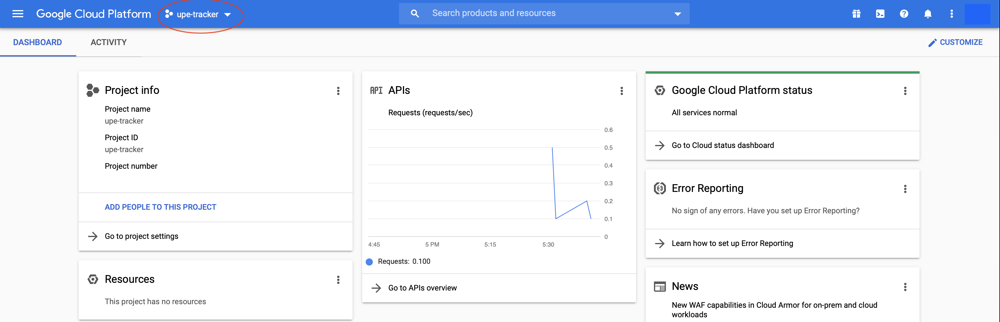
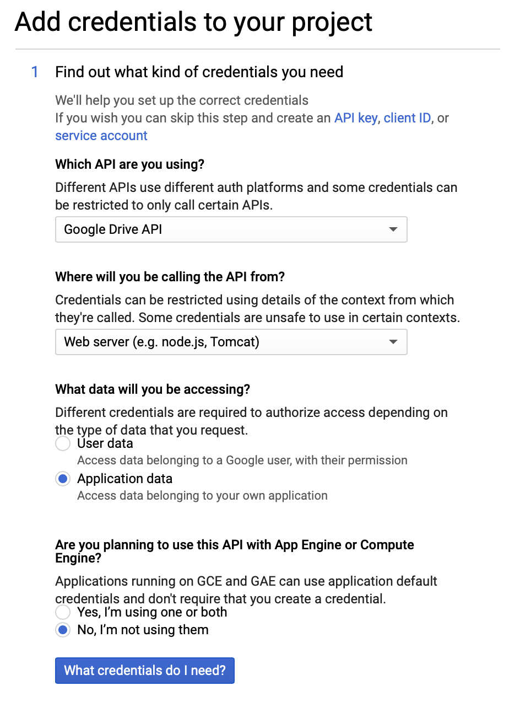
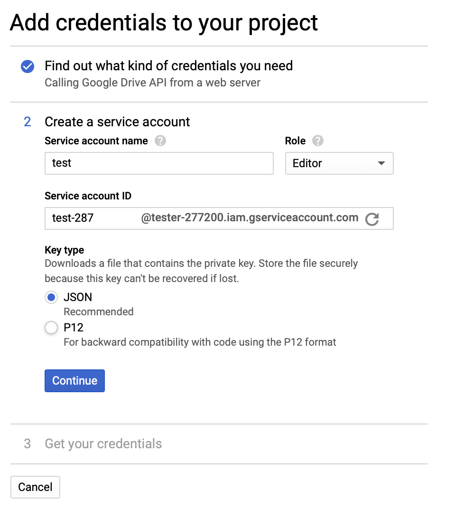
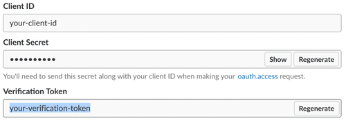
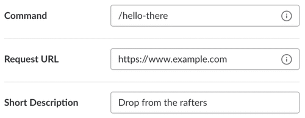
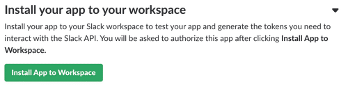

# UPE Slack Bot

## Table of Contents
  - [About](#about)
  - [Getting Started](#getting-started)
    - [Prerequisites](#prerequisites)
    - [Installing](#installing)
  - [Deployment](#deployment)
    - [Flask App Deployment](#flask-app-deployment)
    - [Deploying on OCF Servers](#deploying-on-ocf-servers)
  - [Authors](#authors)

## About
UPE Candidate Tracker is a slack bot used in University of California, Berkeley's Computer Science Honors Society, UPE - NU Chapter. Currently, this is a Flask application that uses Slack and Google Sheets API to enable quick access for candidates a list of their requirement on their track towards members. 
## Getting Started

### Prerequisites
In order to correctly access our spreadsheet, we need to install a couple packages listed below
```python3
pip install flask
pip install gspread 
pip install oauth2client
```

### Installing

Creating API endpoint to access the Google Sheets
1. Go to [Google Cloud Console](https://console.cloud.google.com/home) and create a new project. Name the project as desired
2. Go to the dashboard of the project by clicking the top left dropdown  
   
   

3. Search for `Google Drive API` using the search bar in the middle of the screen
4. Enable Google Drive API and click `Create Credentials` on the left side
5. Fill the form as indicated
   
     </br> 

    
6. Download the JSON credentials file created and rename it into `creds.json`
7. Search for `Google Sheets API` using the search bar and click Enable
8. Copy the `client email` value from our JSON file and share it with the desired spreadsheet  
   This should allow the API to have access to the sheet

Retrieve Slack Bot Information
1. Go to [Slack](https://api.slack.com/) > Your Apps (top right) > Create New App  
   Create a new app for the desired workspace
2. Scroll to `Verification Token` and copy it  
   
     

3. Click on `Add featuress and functionality` > `Slash Commands` > `Create New Command`  
   Fill out the contents indicated  

     

4. Go back to the app's `Basic Information` > click `Install App to Workspace`  
   
     

5. Using a browser, go to the desired workspace and copy the `Team ID` specificed as  
   ```
   https://app.slack.com/client/<team id here>/
   ```

## Deployment

### Flask App Deployment
Like any Flask app export the desired environment variables.  
Fill in the values with the Slack IDs specified above
```
export SLACK_VERIFICATION_TOKEN=your-verification-token
export SLACK_TEAM_ID=your-team-id
export FLASK_APP=upe-tracker.py
```  

### Deploying on OCF Servers
See Berkeley OCF's docs on app hosting

[General](https://www.ocf.berkeley.edu/docs/services/webapps/)  

[Python (Flask)](https://www.ocf.berkeley.edu/docs/services/webapps/python)  

## Authors
- Wallace Lim
- Leon Ming
